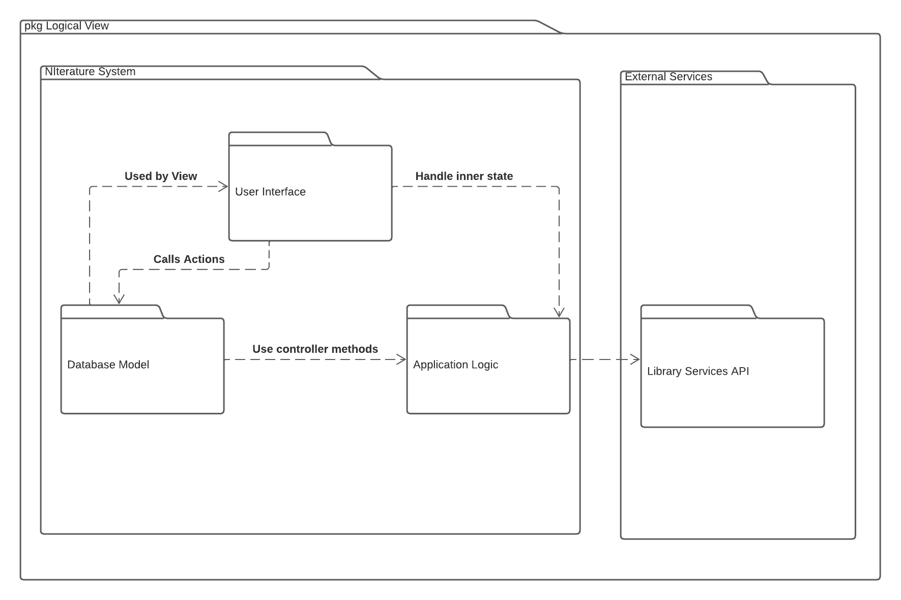
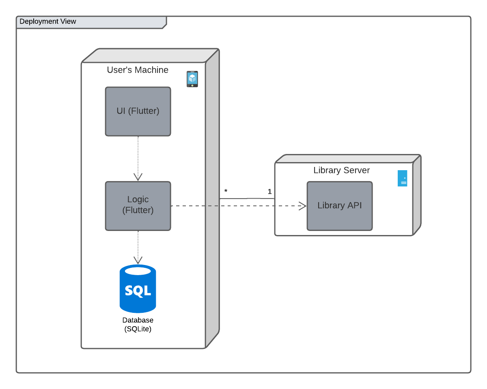
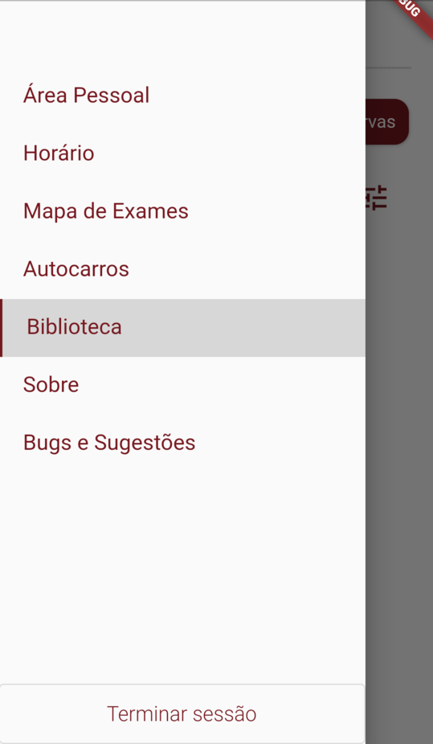

## Architecture and Design

In NIterature, we mainly follow these architectural patterns:
- Client-server pattern, derived by the necessity of using the library services' server to display a good UI to the user.
- Model-View-Controller (MVC), in order to follow the current UNI's app architecture. This way, we ensure the view-only components are independent from the rest of the code, assuring safe reuse of widgets as well as separated testing and development. 

### Logical architecture

### Physical architecture

### Vertical prototype

As of now, our team has implemented a section for the library reservations, which leads the user to an initial version of the book search page:

#### Sidebar:

#### Search Page:

In order to do this, we extended the official UNI app with an extra page in the sidebar, leading to the home page of the project. We then created a new page using Flutter's widgets.
