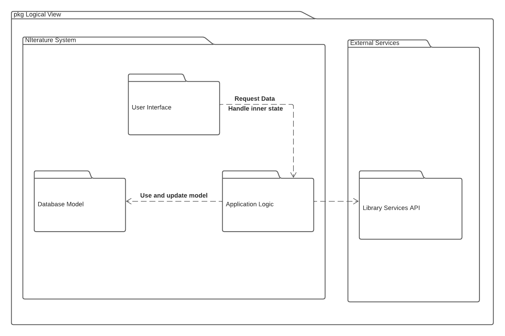

## Architecture and Design

In NIterature, we mainly follow these architectural patterns:
- Client-server pattern, derived by the necessity of using the library services' server to display a good UI to the user.
- Model-View-Controller (MVC), in order to follow the current UNI's app architecture. This way, we ensure the view-only components are independent from the rest of the code, assuring safe reuse of widgets as well as separated testing and development. 

### Logical architecture

### Physical architecture
The goal of this subsection is to document the high-level physical structure of the software system (machines, connections, software components installed, and their dependencies) using UML deployment diagrams (Deployment View) or component diagrams (Implementation View), separate or integrated, showing the physical structure of the system.

It should describe also the technologies considered and justify the selections made. Examples of technologies relevant for uni4all are, for example, frameworks for mobile applications (such as Flutter).

Example of _UML deployment diagram_ showing a _deployment view_ of the Eletronic Ticketing System (please notice that, instead of software components, one should represent their physical/executable manifestations for deployment, called artifacts in UML; the diagram should be accompanied by a short description of each node and artifact):

### Vertical prototype
To help on validating all the architectural, design and technological decisions made, we usually implement a vertical prototype, a thin vertical slice of the system.

In this subsection please describe which feature you have implemented, and how, together with a snapshot of the user interface, if applicable.

At this phase, instead of a complete user story, you can simply implement a feature that demonstrates thay you can use the technology, for example, show a screen with the app credits (name and authors).

