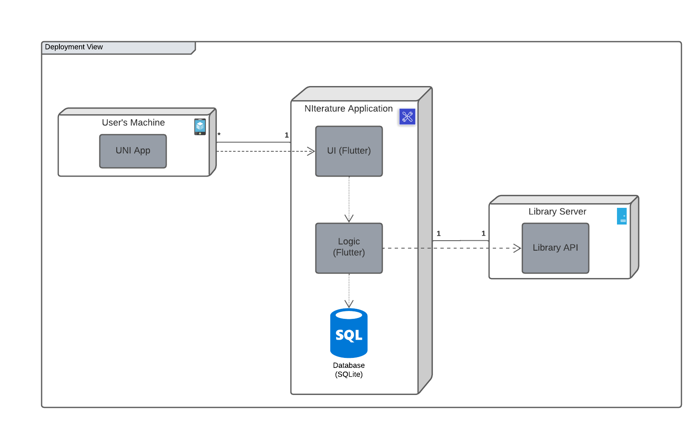

## Architecture and Design

In NIterature, we mainly follow these architectural patterns:
- Client-server pattern, derived by the necessity of using the library services' server to display a good UI to the user.
- Model-View-Controller (MVC), in order to follow the current UNI's app architecture. This way, we ensure the view-only components are independent from the rest of the code, assuring safe reuse of widgets as well as separated testing and development. 

### Logical architecture

### Physical architecture

### Vertical prototype
To help on validating all the architectural, design and technological decisions made, we usually implement a vertical prototype, a thin vertical slice of the system.

In this subsection please describe which feature you have implemented, and how, together with a snapshot of the user interface, if applicable.

At this phase, instead of a complete user story, you can simply implement a feature that demonstrates thay you can use the technology, for example, show a screen with the app credits (name and authors).

