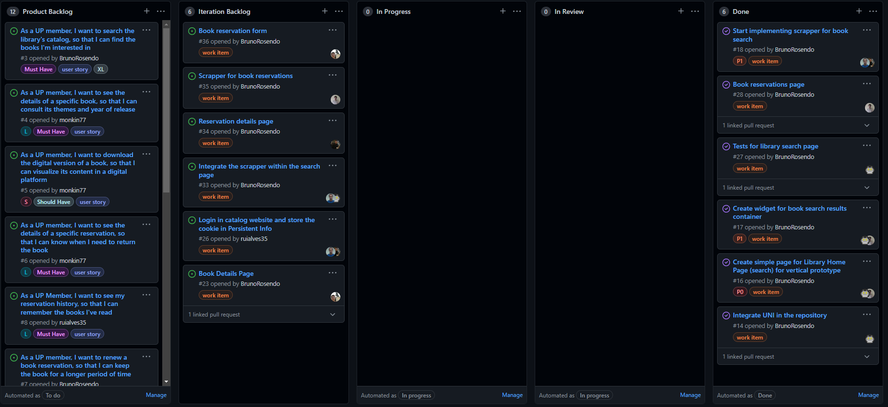

# Iteration #1 Retrospective

## [Release](https://github.com/LEIC-ES-2021-22/3LEIC03T1/releases/tag/v1.0)

## Iteration Retrospective

### What went well?
- We were able to finish all the assigned tasks and fulfill the work plan.
- We made significant progress in the app's interface, by implementing some of the main pages: *Search Page* and *Reservation Page*.
- There were also good advancements in the scrapper, allowing us to retrieve books from the library and its respective details.
- We followed a weekly meeting organization, where we shared our work and assigned new tasks accordingly.
- We continuously reviewed the colleagues' code.

### What should we do differently?
- Do a weekly physical programming session with our colleagues.

### What still puzzles me?
- How to login in the library website through our app.
- Which modules should be covered by the unit tests.
- How to connect the scrapper with the views.

## Project Board
