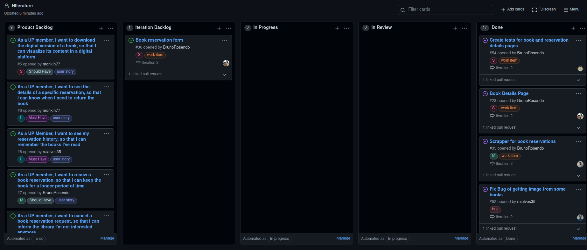

# Iteration #2 Retrospective

## [Release](https://github.com/LEIC-ES-2021-22/3LEIC03T1/releases/tag/v2.0)

## Iteration Retrospective

### What went well?
- We made significant progress in the app's interface, by implementing the reservation and book details pages.
- There were also good advancements in the scrapper, allowing us to login and have access to personal information.
- We followed a weekly meeting organization, where we shared our work and assigned new tasks accordingly.
- We reviewed the colleagues' code.

### What should we do differently?
- We should try to review and apply suggestions earlier, to avoid merge conflicts and increase productivity.

### What still puzzles me?
- Why the gherkin timeout does not work as expected.
- How the website (catálogo) behaves in certain situations, such as reservations and pagination.

## Project Board
