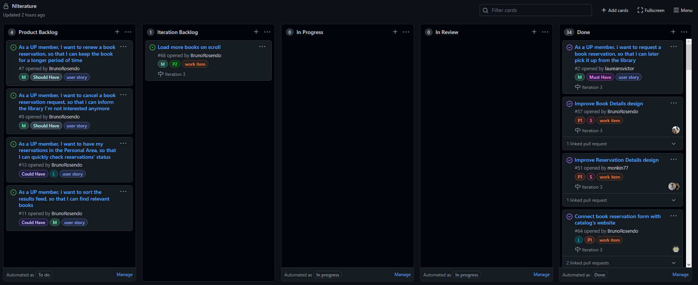

# Iteration #3 Retrospective

## [Release](https://github.com/LEIC-ES-2021-22/3LEIC03T1/releases/tag/v3.0)

## Iteration Retrospective

### What went well?
- We made significant progress in the app's interface improving book details page and reservation details page
- There were also good advancements in the reservation details scrapper, now getting us all the reservations of the user
- We followed a weekly meeting organization, where we shared our work and assigned new tasks accordingly.
- We reviewed the colleagues' code.

### What should we do differently?
- We were too ambitious about the development of this project
- We should have investigated more about the dependencies we use in the project, in this case the "catalogo"

### What still puzzles me?
- How the website (catálogo) behaves in certain situations, such as login and some post requests

## Project Board
