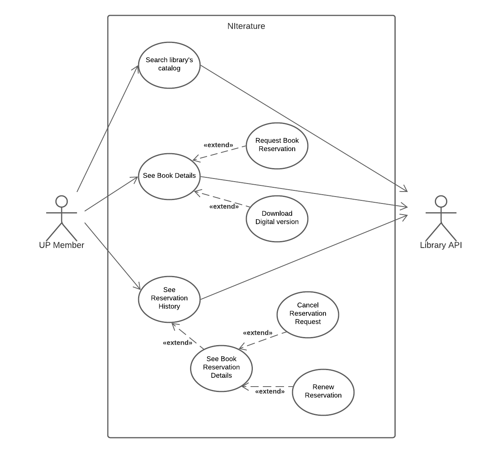

## Requirements

### Use case model 

 

  

|||
| --- | --- |
| *Name* | Search Library's Catalog |
| *Actor* |  UP Member | 
| *Description* | The UP member can search for the books he wants, through filters and text search, from the library's catalog. |
| *Preconditions* | - The user is logged in.   - The input of the user is not empty. |
| *Postconditions* | - The application shows all the results found by the search.   |
| *Normal flow* | 1. The UP member accesses the book search page.   2. The application shows the possible search filters, including a text ba.r   3. The UP member inserts the filters they want to search for.  4. The UP member executes the action to search.  5. The application redirects the user to the Search Results Page. |
| *Alternative flows and exceptions* | 1. [Empty Input] If the UP member didn't insert any input, step 5 of the normal flow will not be executed and a warning will be displayed.   2. [Library API Error] If the Library API returns any error in the results, a warning with the error's description will be displayed to the user. Step 5 of the normal flow will not be executed. |

|||
| --- | --- |
| *Name* | See Book Details |
| *Actor* |  UP Member |
| *Description* | The UP member can check the book details, such as author, publisher, publish date and number of pages. |
| *Preconditions* | - The user is logged in. |
| *Postconditions* | - The application displays the requested book details. |
| *Normal flow* | 1. The UP member selects the book from within the results previously presented.  2. The application display a page with the book details. |
| *Alternative flows and exceptions* | 1. [Library API Error] If the Library API returns any error in the results, a warning with the error’s description will be displayed to the user and step 2 of the normal flow will not be executed. |

|||
| --- | --- |
| *Name* | Request Book Reservation |
| *Actor* |  UP Member | 
| *Description* | The UP member can make a request to reserve a book from the library |
| *Preconditions* | - The user is logged in.   - The book they want to reserve is available in their faculty's library.   - The UP member is not restricted from using the library's services |
| *Postconditions* | - The book will be added to the reservation requests of the UP member.   - When the reservation is accepted, the book will no longer be available. |
| *Normal flow* | 1. The UP member will insert the desired dates of the beginning and end of the book's reservation.  2. The UP member confirms the reservation request.  3. The app shows a confirmation that the reservation was done successfully. |
| *Alternative flows and exceptions* | 1. [Library API Error] If the Library API returns any error in the results, a warning with the error’s description will be displayed to the user and step 3 of the normal flow will not be executed.|

|||
| --- | --- |
| *Name* | Download Digital Version |
| *Actor* |  UP Member | 
| *Description* | The UP member can download the digital version of a book |
| *Preconditions* | - The user is logged in.   - The book has a digital version available |
| *Postconditions* | - The user is redirected to a webpage where they can download the book  |
| *Normal flow* | 1. From the book details page, the user clicks on a *Download to PDF* button   2. The application redirects the user to a webpage where they can download the digital book |
| *Alternative flows and exceptions* | 1. If the URL provided by the library is not functional, the user will not be able to download the book's digital version |

|||
| --- | --- |
| *Name* | See Reservation History |
| *Actor* |  UP Member | 
| *Description* | The UP member can see their history of reservations, including the active ones.|
| *Preconditions* | - The user is logged in.  |
| *Postconditions* | - The application presents information about the user's reservations, such as the title of the book, reservation start date and return date |
| *Normal flow* | 1. The UP member accesses the reservation history page.  2. The application displays the list of books reserved by the UP member |
| *Alternative flows and exceptions* | 1. [Library API Error] If the Library API returns any error in the results, a warning with the error’s description will be displayed to the user and step 2 of the normal flow will not be executed.|

|||
| --- | --- |
| *Name* | See Book Reservation Details |
| *Actor* |  UP Member | 
| *Description* | The UP member can verify the reservation details such as the book's title, return date and check if it's renewable or cancelable |
| *Preconditions* | - The user is logged in.   - The user has a reservation history|
| *Postconditions* | - The application displays information about the book reservation |
| *Normal flow* | 1. The UP member accesses the reservation history page.   2. The UP member will click in the desired reservation.  3. The application displays the details regarding the book reservation.
| *Alternative flows and exceptions* | 1. [Library API Error] If the Library API returns any error in the results, a warning with the error’s description will be displayed to the user and step 3 of the normal flow will not be executed.|

|||
| --- | --- |
| *Name* | Cancel Reservation Request |
| *Actor* |  UP Member | 
| *Description* | The UP member can cancel a reservation request |
| *Preconditions* | - The user is logged in.   - The UP member hasn't picked up the book yet.  |
| *Postconditions* | - The book reservation request is cancelled. |
| *Normal flow* | 1. The UP member accesses the book reservation details page.   2. The UP member clicks the *Cancel Reservation* button.   3. The application displays a confirmation pop-up.   4. The user clicks in the confirm button of the pop-up.   5. The user is redirected to the Reservation History page.
| *Alternative flows and exceptions* | 1. [Library API Error] If the Library API returns any error in the results, a warning with the error’s description will be displayed to the user and step 5 of the normal flow will not be executed.|

|||
| --- | --- |
| *Name* | Renew Reservation |
| *Actor* |  UP Member | 
| *Description* | The UP member can renew a reservation |
| *Preconditions* | - The user is logged in.   - The UP member is not restricted from using the library's services   - The book is still available for reservations |
| *Postconditions* | - The book reservation is renewed and the return date is updated |
| *Normal flow* | 1. The UP member accesses the book reservation details page.   2. The UP member clicks the *Renew Reservation* button.   3. The application displays a confirmation pop-up.   4. The user clicks in the confirm button of the pop-up.   5. The user is redirected to the Reservation History page.
| *Alternative flows and exceptions* | 1. [Library API Error] If the Library API returns any error in the results, a warning with the error’s description will be displayed to the user, the reservation will not be renewed and step 5 of the normal flow will not be executed |

### User stories
This section will contain the requirements of the product described as **user stories**. 

A user story is a description of desired functionality told from the perspective of the user or customer. A starting template for the description of a user story is 

*As a < user role >, I want < goal > so that < reason >.*

As a up member, i want to reserve books so that i can read it.

As a up member, i want to renewal my reservation so that i can keep reading the book for a longer period of time.

User stories should be created and described as [Issues](https://github.com/LEIC-ES-2021-22/templates/issues) in GitHub with the label "user story". See how to in the video [Creating a Product Backlog of User Stories for Agile Development using GitHub](https://www.youtube.com/watch?v=m8ZxTHSKSKE).

You should name the issue with the text of the user story, and, in the "comments" field, add any relevant notes, the image(s) of the user interface mockup(s) (see below) and the acceptance test scenarios (see below). 

**INVEST in good user stories**. 
You may add more details after, but the shorter and complete, the better. In order to decide if the user story is good, please follow the [INVEST guidelines](https://xp123.com/articles/invest-in-good-stories-and-smart-tasks/).

**User interface mockups**.
After the user story text, you should add a draft of the corresponding user interfaces, a simple mockup or draft, if applicable.

**Acceptance tests**.
For each user story you should write also the acceptance tests (textually in [Gherkin](https://cucumber.io/docs/gherkin/reference/)), i.e., a description of scenarios (situations) that will help to confirm that the system satisfies the requirements addressed by the user story.

**Value and effort**.
At the end, it is good to add a rough indication of the value of the user story to the customers (e.g. [MoSCoW](https://en.wikipedia.org/wiki/MoSCoW_method) method) and the team should add an estimation of the effort to implement it, for example, using t-shirt sizes (XS, S, M, L, XL).

### Domain model

To better understand the context of the software system, it is very useful to have a simple UML class diagram with all the key concepts (names, attributes) and relationships involved of the problem domain addressed by your module. 
Also provide a short textual description of each class. 

Example:
 

  

